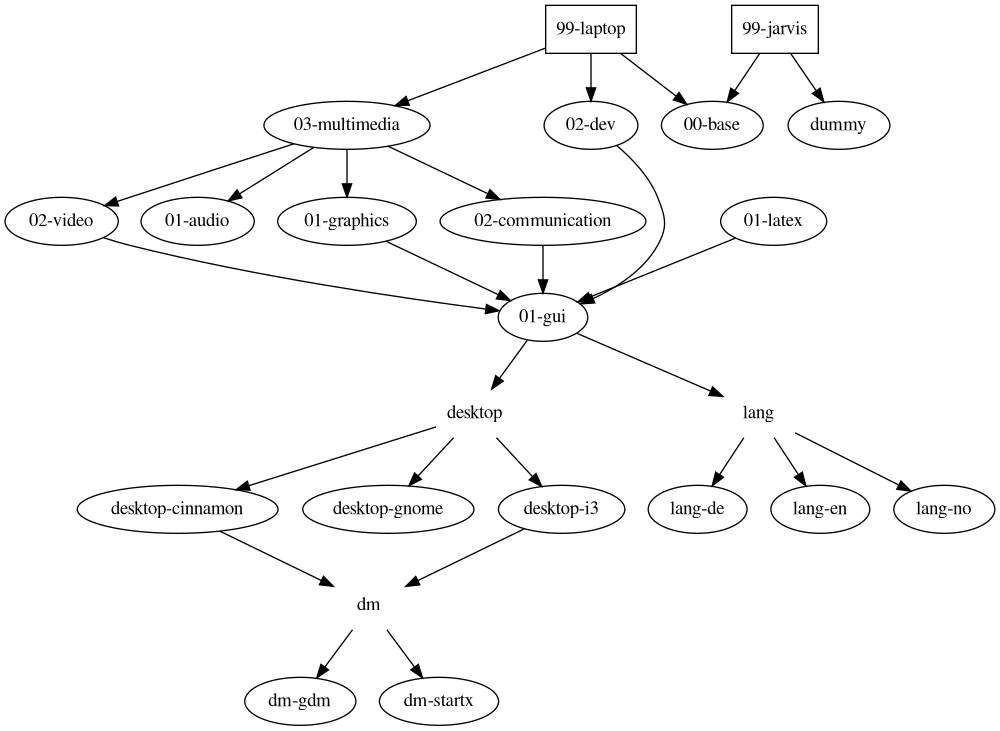

# config

This repo shall bundle as much config as possible.
It assumes the disk has been partitioned and the base system has been bootstrapped.

## holo conventions

- hologram packages shall be named `hologram-name` where `name` is an arbitrary descriptive name, e. g. `hologram-games`
- In the tree (see above) holograms are displayed not by their actual package name but by the name of their ambiguators (The directory names used below `/usr/share/holo/*/`).
- The number of a disambiguator shall be two digits long and as low as possible without being lower than the number of any dependency. The following exceptions exist:
	- The number of the disambiguator of `hologram-base` shall be `00` always. No other hologram must have this number. This means that other holograms have at least `01`. Every holodeck must depend on `hologram-base`.
	- The number of the disambiguator of a holodeck shall be `99` always. No hologram must have this number.

## FIXMEs and TODOs
- Terminal: Don't beep. Add /etc/modprobe.d/nobeep.conf with content "blacklist pcspkr" to hologram-base
- DHCP (but no long waiting when IF down) >See majewsky/system-configuration/holodeck-krikkit (also the # network setup: systemd-resolved is important!)
- wpa_supplicant (see holodeck-krikkit)
- eswitch: Force replacing .emacs.d by symlink when it's not a symlink
- eswitch: When switching, ask if .emacs.d shall be replaced by symlink if it's not a symlink
- Make make return non-zero when a holo-build failed
- move aliases from bash.bashrc to fitting holograms (use #!/usr/bin/tee -a respectively)
- Prompt user for password for laerling (passwd somehow doesn't work in the [[action]] hook)
- Use ART (?)
- Rerun GRUB config after holodeck install in order to include the intel-ucode initrd
- Roll out WHEEL in sudoers with hologram-base
- Move systemd out of init.sh (used for dhcp handling there) into base or something. Use systemd matching on interface to abstract from LAN NIC.
- C3D2 chat (z. B. profanity, (oder, falls einfachere Bedienung als profanity, bitlbee oder irssi+irssi-xmpp))
- shell prompt by pattern <git-repo-name>/path/to/subdir/
- Put recommendations for AUR packages into holograms?
  - E. g. hologram-audio: $(yaourt -Qi mp3splt) for splitting audio files (e. g. flies which are an entire album)
- ln -s /usr/bin/startx /usr/bin/x
- Write holo plugin for cloning git repos (holo-git-repo)
- Don't put any emacs distro in a hologram, but put eswitch there so we can use that for downloading the distros
- Set the EDITOR and VISUAL env vars to emacsclient in the spacemacs hologram (also in hologram-dev?)
- Use sed were possible
- hologram-base: Activate numlock (not only the LEDs but really...)
- Separate hologram-rc because it need not be installed with dev programs automatically. This way it can be a dependency of a holodeck.
- hexchat config (laerling) via (perl) script. Or just use irssi right away
- Thunderbird (E-Mail config too already?)
- firefox config via autoconfig (also see https://wiki.archlinux.de/title/Firefox)
  - Make default browser
  - Plugin
    - umatrix
    - Decentraleyes
- hologram-video: chrome +media.ccc.de as startpage
- vlc config (Allow only one instance, Enqueue items into playlist in one instance mode, use dark theme)
- xterm config (?) (https://wiki.archlinux.de/title/Xterm) (color, font)
- hologram-games
  - steam (multilib, but activate here, not in hologram-base. Pay attention, for it might already be activated)
- Replace dolphin with another mtp-capable graphical file manager like nautilus, nemo, this awesome file manager I once tried, ...
- hologram-latex: What was scribus for again?
- Replace Shift+4 with $ on X for norwegian keyboard layout
- Remove slockhib completely? I only use slocksus and hibernation does not work with encrypted swap anyway. Given, that I even use swap.
